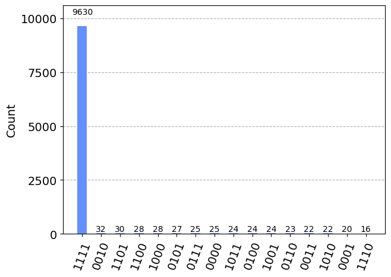
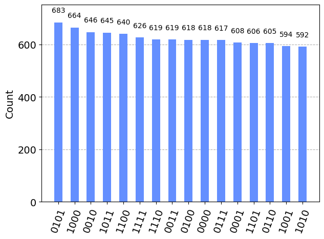

# Find the prime numbers

The task was to decompose a given positive integer into a sum of two prime numbers from a given list. For example,

```
Example_1 = find_primes_numbers (18,[2,3,5,7,11,13,17])
18=5+13

Example_2 = find_prime_numbers(32, [2,3,5,7,11,13,17,19])
32=13+19
```
In the file find_prime_numbers.ipynb, we constructed a circuit which is able to accomplish the task. Additionally, the circuit is written 
such that the list is not restricted to only prime numbers. For example,

```
Example_3 = find_primes_numbers (10,[2,3,4,6])
10=4+6
```
The circuit is constructed by using the well-known Grover's Algorithm. The algorithm consists of multiple parts:
1. We apply Hadamard gates to the all 0 state which creates a state of equal superpositions.
2. We use a constructed oracle to mark the solution states.
3. We use a constructed diffusion operator to amplify the correct states determined from the oracle.
4. We repeat Steps 2 and 3 sufficiently many times and measure the result.
   
From Grover's Algorithm, there is a high probability that we measure the correct state. 

One of the main difficulties in implementing Grover's Algorithm comes from the construction of the oracle. In order to resolve this, we include 2 ancilla qubits in the register where one ancilla marks whether a state is in the correct set and the other marks whether a state has the correct sum. In total, we use 2n+3 qubits where n is the number of bits required to represent the largest positive integer in the list. On the first register, we have n qubits, on the second register, we have n+1 qubits, necessary for the sum, and the last two qubits are the ancillas. 

Running the circuit outputs the following:
```
find_prime_numbers(6, [2,3])
The number 6 can be decomposed as 3+3.
```
From the plot, we can see that the state 1111 is amplified. 
<p align="center">

  
The first two bits 11 come from the first register and the second two bits 11 come from the second register. When converted, the result is the decomposition of 6 into 3+3. Additionally, we can see what happens when there is no solution state. For example,  
```
find_prime_numbers(4, [3])
The quantum algorithm could not decompose 4 as a sum of two elements in [3].
```
We can see the reasoning in the following plot:
<p align="center">


Since there are no solution states, none of the amplitudes are amplified when applying Grover's Algorithm.
