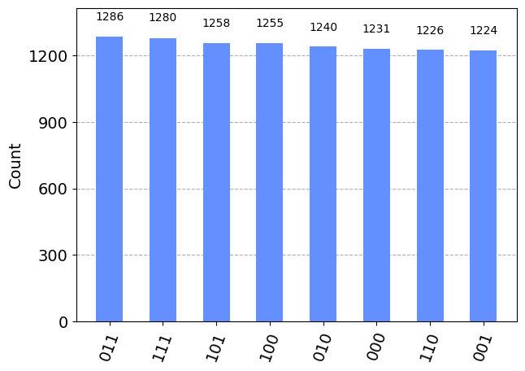
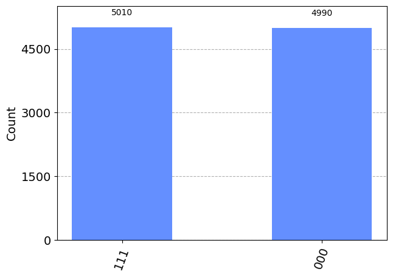
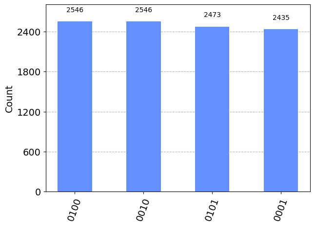
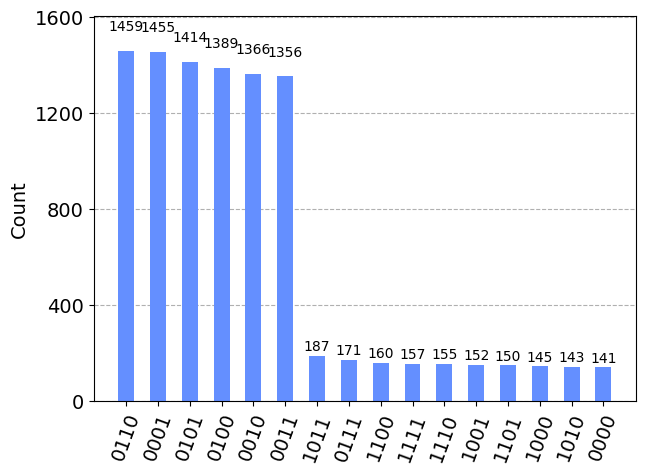

# Less than k

The task was to find numbers less than a positive integer k from a given list of positive integers. For example,

```
Example_1 = less_than_k(7,[4,9,11,14,1,13,6,15])
4,1,6

Example_2 = less_than_k(40,[16,17,14,44,2,51,31,54,47,7,35,59,42,57,56])
16,17,14,2,31,7,35
```
In the file less_than_k.ipynb, we constructed a circuit which is able to accomplish the task. 
The circuit is constructed by using the well-known Grover's Algorithm. The algorithm consists of multiple parts:
1. We apply Hadamard gates to the all 0 state which creates a state of equal superpositions.
2. We use a constructed oracle to mark the solution states.
3. We use a constructed diffusion operator to amplify the correct states determined from the oracle.
4. We measure the result.
   
From Grover's Algorithm, there is a high probability that we measure the correct state. 

One of the main difficulties in implementing Grover's Algorithm comes from the construction of the oracle. In order to resolve this, we include 1 ancilla qubits in the register where the ancilla marks whether a state is in the correct set. In total, we use 2n+1 qubits where n represents the number of bits required to represent the largest integer between elements of the list and the target number. On the first register and second register, we have n qubits, and the last two qubits are the ancillas. We also remark that the leading qubit in the first and second register indicates the sign of the integer where a 0 is positive and a 1 is negative.

Running the circuit outputs the following:
```
less_than_k(7,[4,9,11,14,1,13,6,15])
The subset [6, 1, 4] are the elements in [4, 9, 11, 14, 1, 13, 6, 15] that are less than 7.
```
From the plot, we can see that the state 0110, 0001, 0100 is amplified. 
<p align="center">

   
When converted, the result is that 6, 1, and 4 are the integers in the list less than 7. Additionally, we note that the circuit creates errors for when there are greater than or equal to N/2 solution states where N is the total number of states. For example,
```
less_than_k(6,[1,2,4,5])
The subset [] are the elements in [1, 2, 4, 5] that are less than 6.
```
In this case, the number of solution states is equal to N/2 which is creating the error. We can see the reasoning in the following plot:
<p align="center">


Since the number of solution states is equal to the number of incorrect states, neither of their amplitudes are amplified. We could also have more than N/2 solution states. For example,
```
less_than_k(7,[1,2,3,4,5,6])
The subset [] are the elements in [1, 2, 3, 4, 5, 6] that are less than 7.
```
Since there are more solution states than incorrect states, the incorrect states are amplified by the diffusion operator. This can be seen in the following plot where the incorrect states 0 and 7 are amplified: 
<p align="center">

   
In order to resolve this, we allow for augmentations of the circuit by including two additional qubits. Although this increases the number of qubits, this guarantees that the number of solution states are less than the number of incorrect states. We can revisit the previous cases using the augmented circuits. We have
```
less_than_k(6,[1,2,4,5],augment=True)
The subset [1, 2, 5, 4] are the elements in [1, 2, 4, 5] that are less than 6.
```
with the following plot:
<p align="center">


We also have    
```
less_than_k(7,[1,2,3,4,5,6],augment=True)
The subset [3, 6, 4, 1, 5, 2] are the elements in [1, 2, 3, 4, 5, 6] that are less than 7.
```
with the following plot:
<p align="center">


In most cases, we can assume that there are less solution states than incorrect states; however, we can always resolve the issue by augmenting the circuit to 2n+3 qubits. 
