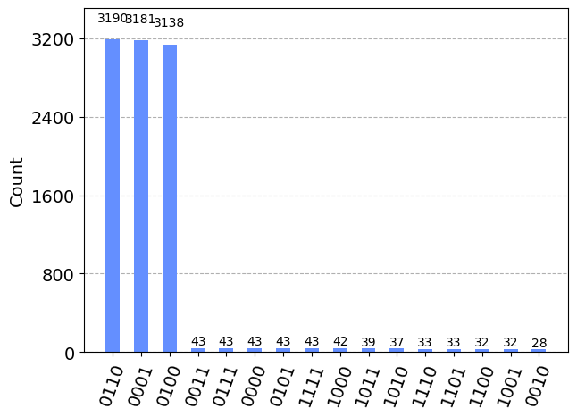

# Less than k

The task was to find numbers less than a positive integer k from a given list of positive integers. For example,

```
Example_1 = less_than_k(7,[4,9,11,14,1,13,6,15])
4,1,6

Example_2 = less_than_k(40,[16,17,14,44,2,51,31,54,47,7,35,59,42,57,56])
16,17,14,2,31,7,35
```
In the file less_than_k.ipynb, we constructed a circuit which is able to accomplish the task. 
The circuit is constructed by using the well-known Grover's Algorithm. The algorithm consists of multiple parts:
1. We apply Hadamard gates to the all 0 state which creates a state of equal superpositions.
2. We use a constructed oracle to mark the solution states.
3. We use a constructed diffusion operator to amplify the correct states determined from the oracle.
4. We measure the result.
   
From Grover's Algorithm, there is a high probability that we measure the correct state. 

One of the main difficulties in implementing Grover's Algorithm comes from the construction of the oracle. In order to resolve this, we include 1 ancilla qubits in the register where the ancilla marks whether a state is in the correct set. In total, we use 2n+1 qubits where n represents the number of bits required to represent the largest integer between elements of the list and the target number. On the first register and second register, we have n qubits, and the last two qubits are the ancillas. We also remark that the leading qubit in the first and second register indicates the sign of the integer where a 0 is positive and a 1 is negative.

Running the circuit outputs the following:
```
less_than_k(7,[4,9,11,14,1,13,6,15])
The subset [6, 1, 4] are the elements in [4, 9, 11, 14, 1, 13, 6, 15] that are less than 7.
```
From the plot, we can see that the state 1111 is amplified. 
<p align="center">

  
The first two bits 11 come from the first register and the second two bits 11 come from the second register. When converted, the result is the decomposition of 6 into 3+3. Additionally, we can see what happens when there is no solution state. For example,  
```
find_prime_numbers(4, [3])
The quantum algorithm could not decompose 4 as a sum of two elements in [3].
```
We can see the reasoning in the following plot:
<p align="center">


Since there are no solution states, none of the amplitudes are amplified when applying Grover's Algorithm.
